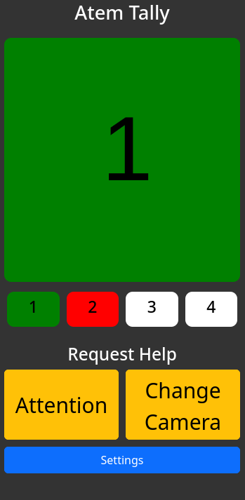

# atemTally

atemTally is a simple tally light for the Blackmagic ATEM Mini Pro. It uses a browser to show which camera is currently on air. The tally light is controlled via the ATEM's network API.

## Requirements
A Blackmagic ATEM Mini Pro (other ATEMs might work, but are untested) connected to the same network as the computer running atemTally. 
Also, a browser is required to display the tally light, a phone or tablet will do just fine.

## Installation
1. Clone this repository
2. Rename .env.template to .env and fill in the required value
3. Run `npm install`
4. Run `npm run build`
5. Run `npm run start`

## Docker
1. Clone this repository
2. Set the required environment variables in the docker-compose.yml file
3. Run `docker-compose up -d`

## Technologies

- [Node.js](https://nodejs.org/en/)
- [TypeScript](https://www.typescriptlang.org/)
- [Express](https://expressjs.com/)
- [Socket.io](https://socket.io/)
- [atem-connection](https://www.npmjs.com/package/atem-connection)
- [node-notifier](https://www.npmjs.com/package/node-notifier)

## Goals
- [x] Display tally light in browser
- [x] Add communication Channel
- [ ] Live preview